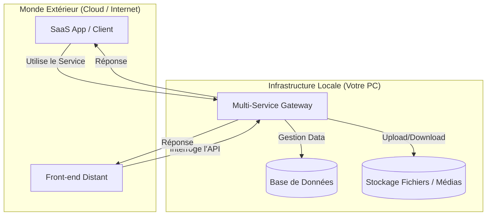

# Local-to-Global Service & SaaS Infrastructure


Ce projet transforme votre machine locale en un **hub de services polyvalent, robuste et accessible via Internet**. L'objectif dépasse le simple backend : il s'agit de fournir une infrastructure complète capable de propulser n'importe quel service (SaaS, API, Stockage, Frontend) que vous souhaitez rendre disponible mondialement.

---

## Objectif du Projet

L'architecture repose sur le concept de **Self-Hosting for Global Innovation**. Votre PC personnel devient une plateforme d'hébergement pour :

1. **Déploiement de Services SaaS** : Transformez vos outils locaux en solutions SaaS accessibles par abonnement ou usage distant.
2. **Infrastructure Multi-Usage** : Hébergez des bases de données, des serveurs de fichiers, ou même des micro-services front-end.
3. **Indépendance Totale** : Évitez les coûts et les limitations du cloud en gardant le contrôle physique de vos données et de vos services.
4. **Interconnexion Globale** : Déployez vos interfaces sur le cloud (GitHub Pages, Vercel) tout en utilisant votre machine locale comme moteur principal.

### Architecture du Système



---

## Spécifications Techniques

Le serveur est conçu pour être une plateforme multi-service légère et sécurisée.

- **Moteur Backend** : Flask (Python) configuré pour gérer une large gamme de requêtes RESTful et de flux de données.
- **Polyvalence des Services** : Supporte l'upload de médias, la gestion de bases de données et l'exécution de logique métier complexe.
- **Sécurité Critique** :
    - **Isolation CORS dynamique** : Protection contre les accès non autorisés tout en permettant l'utilisation par vos domaines personnels.
    - **Anonymisation UUID** : Sécurité renforcée pour le stockage de fichiers sensibles.
    - **Protection Anti-Abus** : Limites de flux et de taille pour préserver les ressources locales.

---

## Guide de Déploiement & Accès Global

### 1. Installation Initiale
```bash
# Cloner le dépôt
git clone https://github.com/brahimcode604/server-local.git
cd server-local

# Installer les dépendances
pip install Flask Flask-Cors Werkzeug
```

### 2. Démarrage du Hub de Services
```bash
python server.py
```

### 3. Transformation en Service Web (Exposition)
Pour rendre votre service ou SaaS accessible partout :

> [!TIP]
> **Option A : Tunneling Professionnel**
> Utilisez **Ngrok** ou **Cloudflared** pour obtenir une URL sécurisée (HTTPS) pointant vers votre service local.
> `ngrok http 5000`

> [!IMPORTANT]
> **Option B : Architecture Réseau Personnalisée**
> 1. Configurez le Port Forwarding sur votre routeur vers votre machine locale.
> 2. Couplez cela à un service DNS pour une identité web stable.

---

## Utilisation par des Applications Distantes

Que ce soit pour un SaaS ou un simple site web, l'intégration est directe :

```javascript
// Exemple d'appel à votre SaaS local depuis le Web
fetch('https://votre-svc-local.com/service-endpoint', {
    method: 'POST',
    headers: { 'Content-Type': 'application/json' },
    body: JSON.stringify({ action: "deploy_something" })
})
.then(res => res.json())
.then(data => console.log("Réponse de mon service local:", data));
```

---

## Équipe de Développement

| Nom | Contribution | Profil |
| :--- | :--- | :--- |
| **Brahim EL BAHLOUL** | Architecture Système | Master SDA - FPS & EST Safi |
| **ABADA Aziz** | Stratégie Documentation | YouCode UM6P |

---

> *"Chaque machine locale est un serveur SaaS en puissance."*
